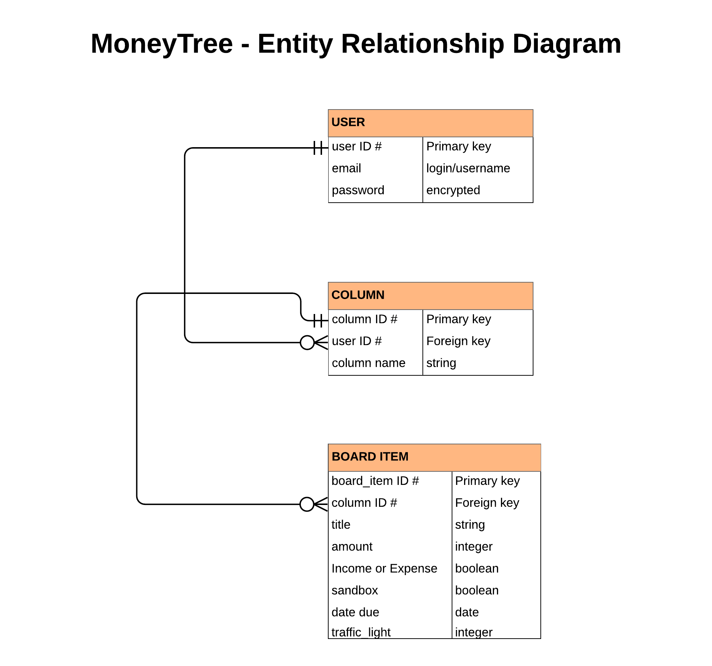

### R1 Description of website

- Purpose
- Functionality / features
- Target audience
- Tech stack

### R2 Dataflow Diagram

Where is the data from, where does it go? What happens to it?
Board components.
User login and password.
Any API's.
ERD:

### R3 Application Architecture Diagram

High level overview of App components:
- Rails backend
- Postgresql
- Ruby Gems
- React front end
- React-Draggable 

### R4 User Stories

The initial idea was to create a Trello-style board in a matrix format with components that include dollar values for budgeting purposes, which feed in to a dashboard.

#### User Expectations

All users will expect the following features or functionality:

- To be provided with clear plain english instructions on how to use the app (i.e. examples with screenshots).
- To have a user friendly dashboard, displaying all the information they need to know.
- To be able to quickly and easily create, move, update, or delete items on the board.
- To be able to customise the board layout, especially with regard to the column headings.
- Potentially to be able to create a board from a pre-planned template.
- To be able to re-purpose the app for different needs (e.g. cash flow planning, budgeting).

#### User Characterisitics

Four distinct target user types were considered: 

- **Sonya the single mum**. Sonya works full time and has two young children, which leaves her very short on time. She cannot earn enough to comfortably provide for her family and often has to make tough choices on what she needs the least (i.e. sacrifices/tradeoffs).

    In her case, the goal of the app is to be able to allow quick and intuitive "what if" scenario planning. At any point if she knows what she has in the bank, she can quickly create and move items around the board to arrive at a result where she knows how much is left after the red category absolutely essential items are included,and can work out the best combination of other items on which to spend any remainder.   
   
- **Max the millenial**. After getting his first job and finding himself with a disposable income for the first time, Max wants to create a budget to be able to save up for the deposit on his first car. 
  
    Max wants to be able to calculate how much he will save each week or month based on his spending choices. After buying the car, he will want to review the budget to include the repayment amounts, petrol, and other running costs to know how much he can spend on upgrades or customisations.

- **A family with 2.4 children**. This user group represents a typical family which has two working parents and two or three children. They do not have to worry about paying the bills, but nor do they have so much money to spare that they have the luxury of a lassiez faire attitude.

    Both parents are earning, but have to spend a large proportion of the income on joint expenses. Although they create a joint account for this purpose, it is not clear how fair the current situation is to each of them. The parents want to be able to work out both how much each of them contributes, and how much disposable income each of them is theoretically left with.

- **Pete the plumber**. Pete is the owner of a small plumbing business. The business is well established and profitable but Pete struggles to juggle the timing of the many cash flows and make sure that there is always money in the bank when it is needed.

    Pete wants to be able to do scenario planning to enable him to plan for what is left after paying his employees. Costs such as inventory and advertising are variable and he also needs to put money aside for his tax bill. Added to this, customers do not always pay on time so he needs to plan accordingly.
    
    Pete needs to know when there will be money leftover to pay himself, and when he needs to put money back in to the business.

### R5 Wireframes for multiple standard screen sizes, created using industry standard software	

### R6 Screenshots of your Trello board demonstrating use throughout the initial stages of the project	

Day 1 AM:

Day 2 PM:

Day 3 AM:

Day 3 PM:

Day 4 AM:

Day 4 PM:

Day 5 AM:

Day 5 PM:
